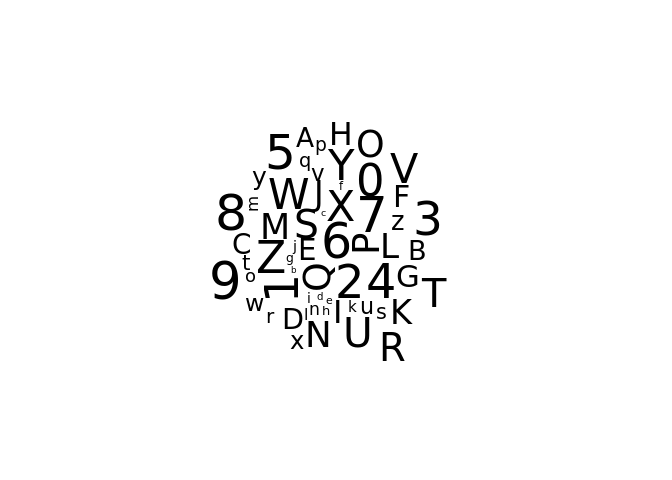

-   [Goals](#goals)
-   [R environment intorduction](#r-environment-intorduction)
-   [Intro to basic math](#intro-to-basic-math)
    -   [Task](#task)
-   [Working directory](#working-directory)
    -   [Task](#task-1)
-   [Packages](#packages)
    -   [Task](#task-2)
-   [Cheatseets](#cheatseets)
-   [Github](#github)
-   [Helpful resources](#helpful-resources)

Goals
=====

-   Understanding the difference between R and Rstudio
-   Get familiar with the Rstudio ui
-   Use the tab, help, understand the package installation, package call
-   Clone and push code to git with ssh
-   Find and read your data

R environment intorduction
==========================

Check all the tabs and what are they used for.<br> What is the difference between R and Rstudio?<br> Create our first project!<br>

Use tab for changing the working directory for the current directory with full path.<br> Create new R file<br> Write into console<br> Check the history of your project<br>

Intro to basic math
===================

``` r
2+3
2^4
sqrt(9)

# check equations
2==3
2!=3

# print the first 20 number 
1:20
```

Task
----

Check if 38 modulo 3 is equal with 0 <details> <summary>Solution</summary>

``` r
38%%3==0
```

    ## [1] FALSE

</details>

Working directory
=================

``` r
getwd()
setwd()
```

Task
----

Read csv in three different way.<br> Data location: <br> - In git: <https://github.com/misrori/aranykezdata> filename: data.csv <br> - Download the file from [here](https://ceuedu-my.sharepoint.com/:x:/g/personal/orsosm_ceu_edu/Eep4TR5kzeROsg4Djd5knaoBVU_eBSL9MowpKRMZHXnbtA?e=u6qIdK)

-   Relativ path (from the working directory)
-   Full path (copy to your desktop and read from there, use tab)
-   Read from git (open the file in row)

<details> <summary>Solution</summary>

``` r
# Relativ path
data <- read.csv('data.csv')

# Full path
# write '/' and then press tab on linux and mac
# write 'C:\' and then press tab on windows and navigate to find your file

data <- read.csv('/home/mihaly/R_codes/ceu-ba-mentoring/data.csv')

# Read from git
data <- read.csv('https://raw.githubusercontent.com/misrori/aranykezdata/master/data.csv')
```

</details>

Packages
========

Find packages on [CRAN](https://cran.r-project.org)<br> Power of F1 and help <br>

Task
----

Create a wordcloud with R <details> <summary>Hint</summary> Check out wordcloud package and the documentation of that. </details>

<details> <summary>Solution</summary>

``` r
library(wordcloud)
```

    ## Loading required package: RColorBrewer

``` r
wordcloud(c(letters, LETTERS, 0:9), seq(1, 1000, len = 80))
```



</details>

Cheatseets
==========

Check out the [cheatseets](https://www.rstudio.com/resources/cheatsheets/) They are very useful!

Github
======

Clone [this](https://github.com/daroczig/CEU-R-lab) repo from github and check the working directory and the files inside the folder.<br> Install [this](https://github.com/daroczig/logger) package from github

Helpful resources
=================

-   Detailed learning material [We3school](https://www.w3schools.com/r/default.asp)
-   Basic R test [Hackerrank](https://www.hackerrank.com/skills-verification/r_basic)
-   Free introduction to R course [Datacamp](https://www.datacamp.com/courses/free-introduction-to-r)
