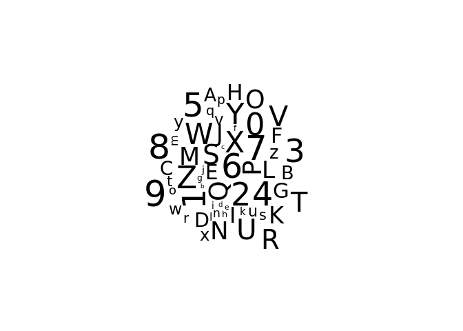
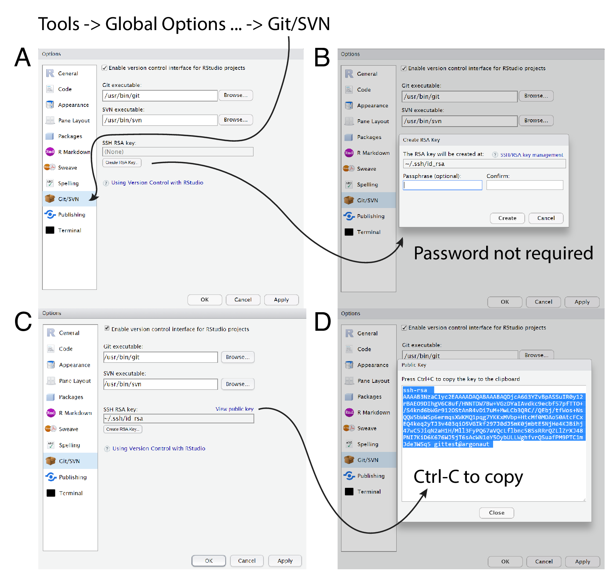

-   [Goals](#goals)
-   [R environment intorduction](#r-environment-intorduction)
-   [Intro to basic math](#intro-to-basic-math)
    -   [Task](#task)
-   [Working directory](#working-directory)
    -   [Task](#task-1)
-   [Packages](#packages)
    -   [Task](#task-2)
-   [Cheatseets](#cheatseets)
-   [Github](#github)
-   [Helpful resources](#helpful-resources)

Goals
=====

-   Understanding the difference between R and Rstudio
-   Get familiar with the Rstudio ui
-   Use the tab, help, understand the package installation, package call
-   Clone and push code to git with ssh
-   Find and read your data

R environment intorduction
==========================

## Check all the tabs and what are they used for.

1. **Console window**: Write commands and execute them by hitting an Enter.  


2. **Plain text editor window**: Write commands and execute them by hitting Ctrl + Enter (or use the Run toolbar button) and save the script.

3. **Files / Plots / Packages / Help / Viewer window**: 
    * Navigate files and folders, create/delete/rename files.
    * Set the working directory.
    * Display plots.
    * Install packages.

4. **Environment / History / Connections window**
    * Lists all objects in the environment.
    * Command history stored.
    * Version control.

## What is the difference between R and Rstudio?

* **R** is an open-source programming language that can be used for writing programs, for web scraping, for using machine learning algorithms etc.

* **RStudio** is an advance version of R with integrated development environment (IDE).
    * Interaction with objects stored in the environment.
    * Accessible graphics.
    * R Markdown.
    * Version control.

## Create our first project!

* A **project** is a collection of work organized in a folder.

* **Creating a new project**: File -> New Project -> New Directory -> New Project


Use tab for changing the working directory for the current directory with full path.

Create new R file

Write into console

Check the history of your project

Intro to basic math
===================

``` r
# Basic math operatiors
2+3
2^4
sqrt(9)

# Logical operatiors
2==3
2!=3

# Print the first 20 number 
1:20
```

Task
----

Check if 38 modulo 3 is equal with 0 <details> <summary>Solution</summary>

``` r
38%%3==0
```

    ## [1] FALSE

</details>

Working directory
=================

The **working directory** is the folder where you have to store your files of your project in order to load them or where your R objects will be saved.

``` r
# Find the current working directory
getwd()

# Set the working directory
setwd()
```

Task
----

Read csv in three different ways.<br> Data location: <br> - In git: <https://github.com/misrori/aranykezdata> filename: data.csv <br> - Download the file from [here](https://ceuedu-my.sharepoint.com/:x:/g/personal/orsosm_ceu_edu/Eep4TR5kzeROsg4Djd5knaoBVU_eBSL9MowpKRMZHXnbtA?e=u6qIdK)

-   Relative path (from the working directory)
-   Full path (copy to your desktop and read from there, use tab)
-   Read from GitHub (open the file in **Raw**)

<details> <summary>Solution</summary>

``` r
# Relative path
data <- read.csv('data.csv')

# Full path
# write '/' and then press tab on Linux and Mac
# write 'C:\' and then press tab on Windows and navigate to find your file

data <- read.csv('/home/mihaly/R_codes/ceu-ba-mentoring/data.csv')

# Read from git
data <- read.csv('https://raw.githubusercontent.com/misrori/aranykezdata/master/data.csv')
```

</details>

Packages
========

**Packages** are extensions to R that can be installed by the users.

* Collections of functions and can also contain data and documentation.
* Created and developed by users of R.

The R packages can be instaled from CRAN or from GitHub.
1. Installing packages from [CRAN](https://cran.r-project.org)

``` r
install.packages("zoo", dependencies = TRUE) 
``` 

2. Installing packages from GitHub
* Often, cutting edge development versions of R packages are hosted on GitHub.
* First, the **devtools** package needs to be installed and loaded.

``` r
install.packages("devtools") 
library(devtools)
``` 
* Then we can install from the user repo.

``` r
install_github('daroczig/logger')
``` 

Find packages on [CRAN](https://cran.r-project.org)<br> Power of F1 and help <br>

Task
----

Create a wordcloud with R <details> <summary>Hint</summary> Check out wordcloud package and the documentation of that. </details>

<details> <summary>Solution</summary>

``` r
library(wordcloud)
```

    ## Loading required package: RColorBrewer

``` r
wordcloud(c(letters, LETTERS, 0:9), seq(1, 1000, len = 80))
```



</details>

Cheatseets
==========

Check out the [cheatseets](https://www.rstudio.com/resources/cheatsheets/) 

They are very useful!

Github
======
* RStudio allows us to use Git version control with our own project in a very easy and convenient way. 

* Pre-requisites:
    * Registered GitHub account.
    * Installed R and RStudio.
    * Installed Git.

* We need to create an SSH keypair.
    * In the Git/SVN tab, hit Create RSA Key. In the window that appears, hit the Create button.
    * Click, View public key, and copy the displayed public key.
    * On the GitHub website, open the account settings tab and click the SSH keys tab Click Add SSH key and paste in the public key copied from RStudio.




## Cloning a repository
* Creating a copy of an existing Git repository to our local machine. 
* On the GitHub website, go to the repository you want to clone.
* Go to Code and copy the URL.


* In RStudio create a new project with version control.
    * File -> New Project -> Version control -> Git 
* Paste the URL copied from GitHub.


Task
----

Clone [this](https://github.com/daroczig/CEU-R-lab) repo from github and check the working directory and the files inside the folder.

## Creating a new project with version control
* On GitHub create a new repository.
* Clone the repository to your machine as above.

Task
----

Create a new project with version control.

Helpful resources
=================

-   Detailed learning material [We3school](https://www.w3schools.com/r/default.asp)
-   Basic R test [Hackerrank](https://www.hackerrank.com/skills-verification/r_basic)
-   Free introduction to R course [Datacamp](https://www.datacamp.com/courses/free-introduction-to-r)
