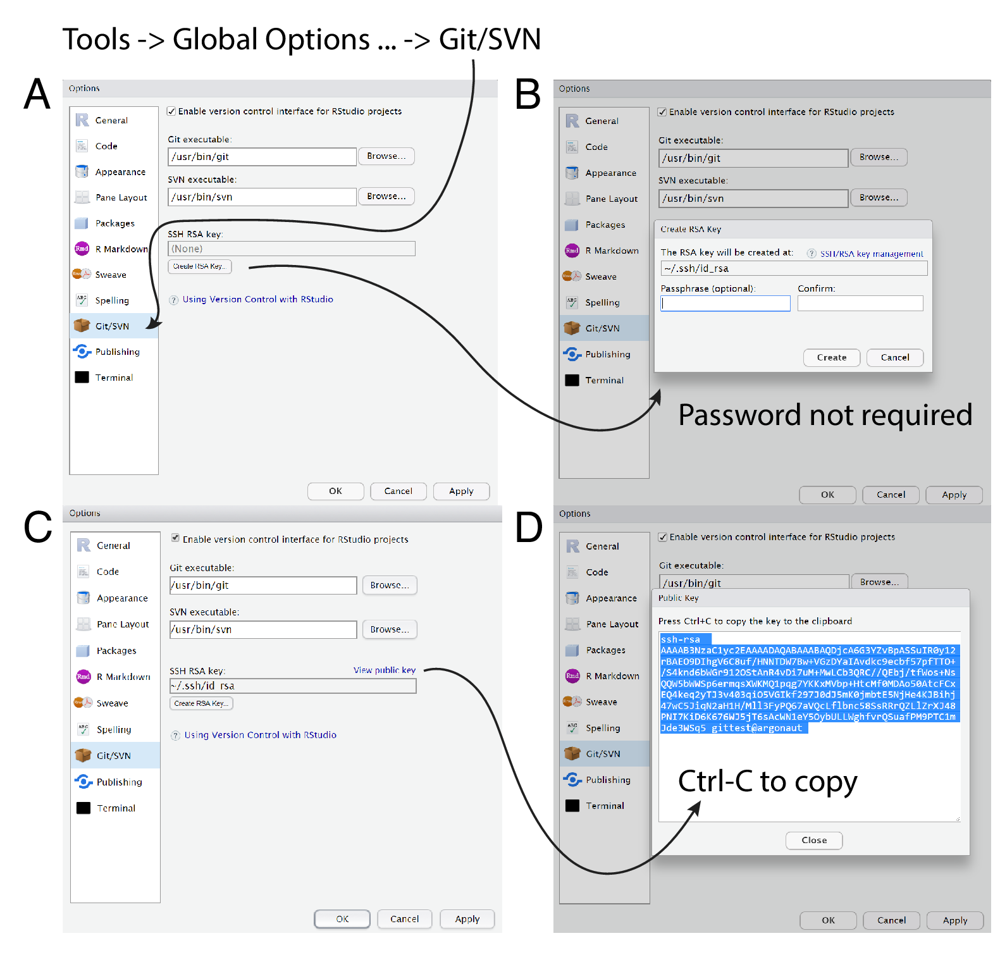

-   [Goals](#goals)
-   [Git](#git)
    -   [Setup Rstudio with your github profile](#setup-rstudio-with-your-github-profile)
    -   [Git task: project with collaborator](#git-task-project-with-collaborator)
    -   [Git task: create pull request](#git-task-create-pull-request)
-   [R markdown](#r-markdown)
    -   [Prettydoc](#prettydoc)
    -   [Task](#task)

Goals
=====

-   Clone and push code to GitHub with SSH in a team
-   Understanding the concept of Rmarkdown

Git
===

Setting up RStudio with your github profile
--------------------------------------

- RStudio allows us to use Git version control with our own project in a very easy and convenient way. 
- We can clone others GitHub repos or we can create our own GitHub repo and share it with others from RStudio.
- To synchronize our project with GitHub we need to connect to GitHub using SSH.

1. Pre-requisites:
    - Registered GitHub account.
    - Installed R and RStudio.
    - Installed Git.
2. We need to enable version control
    - In RStudio go to Tools / Global Options... / Git/SVN.
    - Make sure that the checkbox next to enable version control is marked.
3. We need to create an SSH keypair. 
    - In the Git/SVN tab, hit Create RSA Key. In the window that appears, hit the Create button.
    - Click, View public key, and copy the displayed public key.
    - On the GitHub website, open the account settings tab and click the SSH keys tab Click Add SSH key and paste in the public key copied from RStudio.



The steps are also written [here](https://github.com/daroczig/CEU-R-skills#technical-prerequisites)

Fork and clone
--------------------------------------

**Fork**
- Fork creates an **independent copy** of the original Git repo in your GitHub.
- Forking a repository allows the user to freely create modifications and changes without affecting the original project.
- A forked repo will **not synchronize** with the original repository.
- It is better to fork before clone if you do not have write permission to the folder (you are not a contributor) or the project is the starting point of your own project.

**Clone**
- Clone creates a **linked copy** of the original Git repo.
- Cloning allows the user to make changes directly to the original project.
- A cloned repo will **continue to synchronize** with the original repository.


Work in team of two and solve the next tasks.

Git task: project with collaborator
-----------------------------------

-   Team up in two
-   Someone create a repo called `test`.
-   Create a `Hello world` commit.(create an R file and print out `Hello world`) and push
-   Invite your team member to collaborator.
-   Your team member also add a file to your git repo and change the Hello world commit to `Hello CEU` and push
-   Now change

Git task: create pull request
-----------------------------

-   Team up in two
-   Someone create a repo called `test2`.
-   Same task but now your team member is not going to be collaborator.
-   In that case your team member, fork, change and create pull request to you, and you will merge.
-   Now change

R markdown
==========

Get started [here](https://rmarkdown.rstudio.com/index.html) 
Read and complate all the task at home <br> Check out the [R markdown cheatsheet](https://www.rstudio.com/wp-content/uploads/2015/02/rmarkdown-cheatsheet.pdf)<br> Also you can find other cheatsheets go to help -&gt; cheetsheets

Prettydoc
---------

Install the prettydoc package

``` r
install.packages('prettydoc')
```

Check out the different themes for R markdown documnets [here](https://prettydoc.statr.me/themes.html).

Task
----

Replicate [this html](week-2/Sample_markdown.html)

